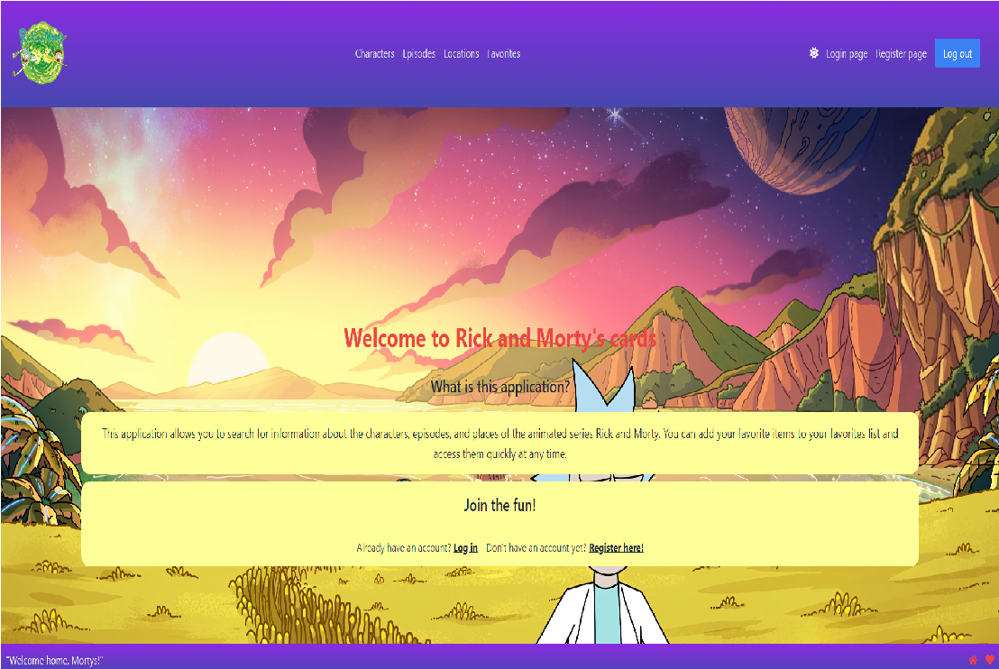
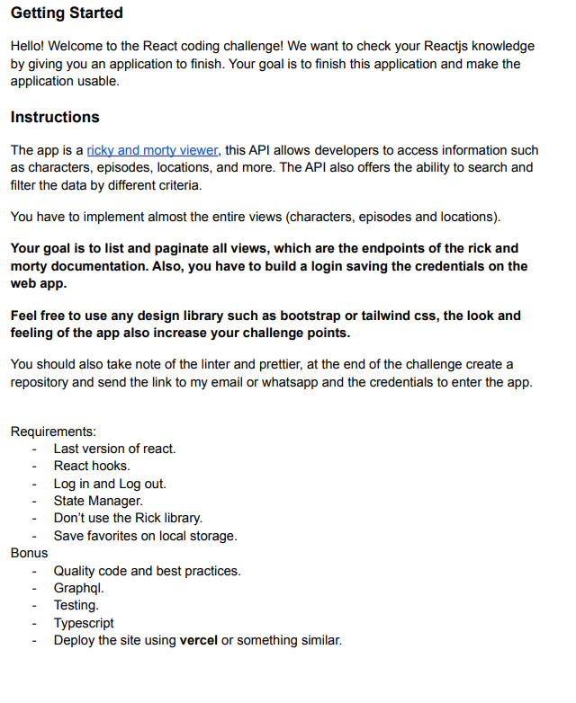

# Title: React Challenge - Rick and Morty Visor

# Deployment (Vercel)

Check the demo: https://react-challenge-joga50.vercel.app/

# Introduction:

The Rick and Morty Visor is an application that displays cards of characters, locations, and episodes from the famous animated TV series "Rick and Morty". The application is designed to help users learn more about the show.

# Features:

The application has multiple pages, including the characters, locations, episodes, and favorites pages. Users can register, login, and logout using local storage. Additionally, there is a theme change option using React Redux. All the queries to the API are made using GraphQL.

# Installation:

To install the Rick and Morty Visor app, follow these simple steps:

Clone the repository:

- Run "npm i"
  to install the dependencies
- Run "npm start"
  to start the app

# Usage:

Once the app is installed, you can navigate through the characters, locations, episodes, and favorites pages. Users can register, login, and logout, and they can also add and filter cards on the favorites page.

# License:

This project was created solely for testing technical and challenging skills, and it has no other purpose.

# Credits:

RankCV provided the activity to develop this project, and credits go to them.
